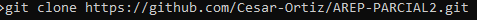
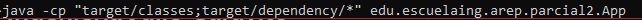
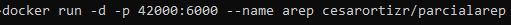
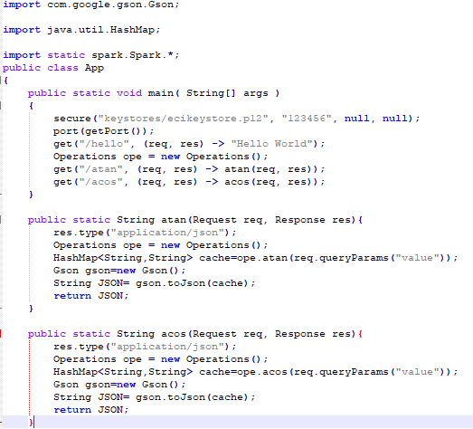
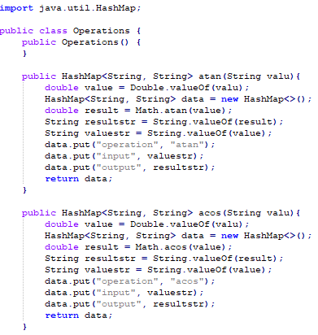
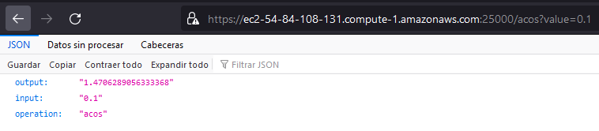
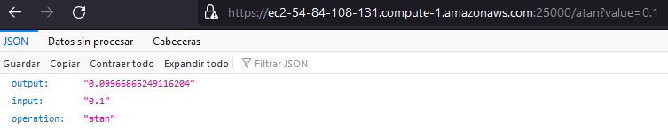
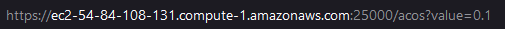
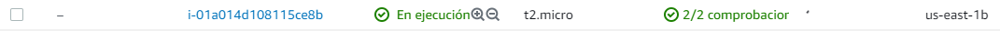

# Escuela Colombiana de Ingeniería Julio Garavito
## Parcial AREP 2
## 👤 Autor
César Fernando Ortiz Rocha

##  Instrucciones para usar el proyecto

Primero se debe clonar el repositorio con el comando que se ve a continuación

luego una vez clonado y dentro de los archivos del repositorio podemos correr el proyecto de dos maneras una es ejecutando el comando:

Y la otra es correndo el proyecto por medio de la imagen que esta subida en dockerhub de la siguiente manera

## Funcionamiento

En el funcionamiento se hicieron dos clases las cuales fueron:

### APP

En esta clase se realizaron los dos endpoints get(/acos) y get(/atan), cada uno de ellos iba a sacar la arcotangente o el arcocoseno segun correspondiera y devolveria como resultado un json.

### Operations

En la clase operations se realizarón los calculos del valor que entraba por el path y se guarda el resulado junto con la entrada y el tipo de operación en un HashMap y se retornaba este Hashmap a la clase principal.

### Pruebas

prueba del funcionamiento con https en aws de la oparación acos

prueba del funcionamiento con https en aws de la oparación atan

## Correrlo en EC2

Para correrlo en EC2 lo inico que se debe hacer es crear una instancia en aws, y habilitar el puerto 25000 que es por donde va a correr el proyecto, habilitando este en la parte de grupos de seguridad, luego lo unico que queda es ingresar por medio de la url mostrada abajo.

## video demostrativo

[Evidencia-parcial](https://youtu.be/qGyLemLvgfo)
